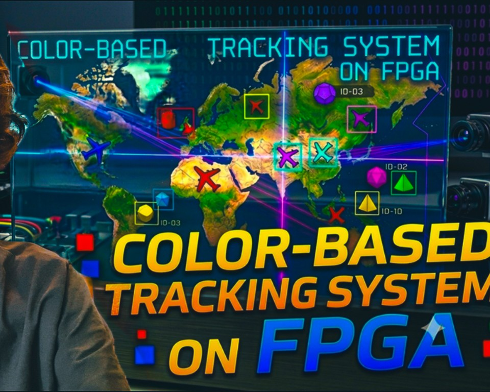

  
  <h1>Nazanin Azhdari</h1>
  <h3>Embedded Systems Engineering Student</h3>
  

    <a href="https://github.com/NazaninAzhdari" target="_blank"><b>GitHub</b></a> &nbsp;&bull;&nbsp;
    <a href="https://www.linkedin.com/in/Nazanin-Azhdari-49b315341" target="_blank"><b>LinkedIn</b></a> &nbsp;&bull;&nbsp;
    <a href="https://youtube.com/@Fun-PGA" target="_blank"><b>YouTube</b></a> &nbsp;&bull;&nbsp;
    <a href="mailto:Nazanin.Azhdari.sbu@gmail.com"><b>Email</b></a>
  

---

## About Me

My name is **Nazanin Azhdari**, and I am currently a second‑year student studying **IT Engineering** at **Vaasa University of Applied Sciences**, with a specialization in **Embedded Systems**.  
I love working with **circuits**, **FPGAs**, **Microcontrollers**, **Hardware**, and more. Take a look at some of my projects on this page to see what I've been up to.  
I also have a YouTube channel where I upload videos about my projects. If you want, you can take a look at my channel:
  *   **Youtube:** [Fun-PGA](https://youtube.com/@Fun-PGA)

You can download a PDF copy of my resume [here]().  
Also make sure to take a look around here to see some of my projects in more detail!  
   

---

  <h1>My Projects</h1>

## Image and Audio Processing on FPGA
<!-- First Row of Projects( 3 Projects) -->

  <!-- Project 1 -->
  

    

      
      <h3 style="margin: 10px 0 6px 0; font-size: 1.1rem;">Image Processing on FPGA</h3>
      
I Built a real‑time image processing system on an FPGA that applies multiple visual effects and outputs the result to an HDMI display. I Implemented effects such as brightness, contrast, grayscale, mirror, pixelize, color tint, solarize, fire, rainbow and more. All effects are written in VHDL.

    

    

      <a href="https://github.com/NazaninAzhdari/hdmi-img-processing" style="display: inline-block; padding: 5px 10px; background: #f1f8ff; color: #0366d6; border: 1px solid #c8e1ff; border-radius: 4px; text-decoration: none; font-size: 0.85rem; font-weight: 600; margin-right: 5px; margin-bottom: 5px;">View Project →</a>
      <a href="لینک_ویدیو_یوتیوب" target="_blank" style="display: inline-block; padding: 5px 10px; background: #e6ffed; color: #28a745; border: 1px solid #acf2bd; border-radius: 4px; text-decoration: none; font-size: 0.85rem; font-weight: 600; margin-bottom: 5px;">Watch Demo ▶️</a>
    

  

  <!-- Project 2 -->
  

    

      
      <h3 style="margin: 10px 0 6px 0; font-size: 1.1rem;">Real-Time Color Tracker on FPGA</h3>
      
This project is a hardware system in VHDL that tracks moving objects based on their color. The system detects 12 color shades, draws a bounding box around the selected color, and displays the object’s X/Y coordinates in real time.

    

    

      <a href="https://github.com/NazaninAzhdari/real-time-color-tracker" style="display: inline-block; padding: 5px 10px; background: #f1f8ff; color: #0366d6; border: 1px solid #c8e1ff; border-radius: 4px; text-decoration: none; font-size: 0.85rem; font-weight: 600; margin-right: 5px; margin-bottom: 5px;">View Project →</a>
      <a href="لینک_ویدیو_یوتیوب" target="_blank" style="display: inline-block; padding: 5px 10px; background: #e6ffed; color: #28a745; border: 1px solid #acf2bd; border-radius: 4px; text-decoration: none; font-size: 0.85rem; font-weight: 600; margin-bottom: 5px;">Watch Demo ▶️</a>
    

  

  <!-- Project 3 -->
  

    

      
      <h3 style="margin: 10px 0 6px 0; font-size: 1.1rem;">Audio Engine on FPGA</h3>
      
This Project is an Audio Engine on FPGA that receives ASCII characters over UART and turns them into musical melodies. The system generates 28 unique square‑wave melodies (such as sirens, retro game tones, toy sounds, and more), and transmits 24‑bit audio samples through a fully custom I2S interface.

    

    

      <a href="https://github.com/NazaninAzhdari/i2s-audio-engine" style="display: inline-block; padding: 5px 10px; background: #f1f8ff; color: #0366d6; border: 1px solid #c8e1ff; border-radius: 4px; text-decoration: none; font-size: 0.85rem; font-weight: 600; margin-right: 5px; margin-bottom: 5px;">View Project →</a>
      <a href="لینک_ویدیو_یوتیوب" target="_blank" style="display: inline-block; padding: 5px 10px; background: #e6ffed; color: #28a745; border: 1px solid #acf2bd; border-radius: 4px; text-decoration: none; font-size: 0.85rem; font-weight: 600; margin-bottom: 5px;">Watch Demo ▶️</a>
    

  

## Retro Games on FPGA
<!-- Second Row of Projects ( 3 Projects) -->

  <!-- Project 4 -->
  

    

      
      <h3 style="margin: 10px 0 6px 0; font-size: 1.1rem;">Space Invaders Game on FPGA</h3>
      
This project is an implementation of the classic arcade game “Space Invaders.” Everything is synchronized to 640×480 VGA timing at 60 Hz. The game includes an I2S‑based audio engine for sound and a UART‑RX interface for communicating with the game.

    

    

      <a href="https://github.com/NazaninAzhdari/space-invaders-game" style="display: inline-block; padding: 5px 10px; background: #f1f8ff; color: #0366d6; border: 1px solid #c8e1ff; border-radius: 4px; text-decoration: none; font-size: 0.85rem; font-weight: 600; margin-right: 5px; margin-bottom: 5px;">View Project →</a>
      <a href="لینک_ویدیو_یوتیوب" target="_blank" style="display: inline-block; padding: 5px 10px; background: #e6ffed; color: #28a745; border: 1px solid #acf2bd; border-radius: 4px; text-decoration: none; font-size: 0.85rem; font-weight: 600; margin-bottom: 5px;">Watch Demo ▶️</a>
    

  

  <!-- Project 5 -->
  

    

      
      <h3 style="margin: 10px 0 6px 0; font-size: 1.1rem;">Chrome Dino Game on FPGA</h3>
      
This project contains a complete reconstruction of the famous "Chrome Dino" game, designed to run on FPGA using pure VHDL.

    

    

      <a href="https://github.com/NazaninAzhdari/dino-game" style="display: inline-block; padding: 5px 10px; background: #f1f8ff; color: #0366d6; border: 1px solid #c8e1ff; border-radius: 4px; text-decoration: none; font-size: 0.85rem; font-weight: 600; margin-right: 5px; margin-bottom: 5px;">View Project →</a>
      <a href="لینک_ویدیو_یوتیوب" target="_blank" style="display: inline-block; padding: 5px 10px; background: #e6ffed; color: #28a745; border: 1px solid #acf2bd; border-radius: 4px; text-decoration: none; font-size: 0.85rem; font-weight: 600; margin-bottom: 5px;">Watch Demo ▶️</a>
    

  

  <!-- Project 6 -->
  

    

      
      <h3 style="margin: 10px 0 6px 0; font-size: 1.1rem;">Simon's Memory Game on FPGA</h3>
      
This Project is a hardware version of the Simon memory‑testing game using VHDL on FPGA. The game shows a random sequence of lights and sounds, and the player must repeat the pattern correctly to advance.

    

    

      <a href="https://github.com/NazaninAzhdari/simon-memory-game" style="display: inline-block; padding: 5px 10px; background: #f1f8ff; color: #0366d6; border: 1px solid #c8e1ff; border-radius: 4px; text-decoration: none; font-size: 0.85rem; font-weight: 600; margin-right: 5px; margin-bottom: 5px;">View Project →</a>
      <a href="لینک_ویدیو_یوتیوب" target="_blank" style="display: inline-block; padding: 5px 10px; background: #e6ffed; color: #28a745; border: 1px solid #acf2bd; border-radius: 4px; text-decoration: none; font-size: 0.85rem; font-weight: 600; margin-bottom: 5px;">Watch Demo ▶️</a>
    

  

<!-- Third Row of Projects ( 3 Projects) -->

  <!-- Project 7 -->
  

    

      
      <h3 style="margin: 10px 0 6px 0; font-size: 1.1rem;">Pong Game on FPGA</h3>
      
This project is an implementation of iconic Pong game entirely in hardware. It supports two-player gameplay, where players use buttons to control their paddles and prevent a ball from passing their side.

    

    

      <a href="https://github.com/NazaninAzhdari/pong-game" style="display: inline-block; padding: 5px 10px; background: #f1f8ff; color: #0366d6; border: 1px solid #c8e1ff; border-radius: 4px; text-decoration: none; font-size: 0.85rem; font-weight: 600; margin-right: 5px; margin-bottom: 5px;">View Project →</a>
      <a href="لینک_ویدیو_یوتیوب" target="_blank" style="display: inline-block; padding: 5px 10px; background: #e6ffed; color: #28a745; border: 1px solid #acf2bd; border-radius: 4px; text-decoration: none; font-size: 0.85rem; font-weight: 600; margin-bottom: 5px;">Watch Demo ▶️</a>
    

  

  <!-- Project 8 -->
  

    

      
      <h3 style="margin: 10px 0 6px 0; font-size: 1.1rem;">Chrome Dino Game on FPGA</h3>
      
This project contains a complete reconstruction of the famous "Chrome Dino" game, designed to run on FPGA using pure VHDL.

    

    

      <a href="https://github.com/NazaninAzhdari/dino-game" style="display: inline-block; padding: 5px 10px; background: #f1f8ff; color: #0366d6; border: 1px solid #c8e1ff; border-radius: 4px; text-decoration: none; font-size: 0.85rem; font-weight: 600; margin-right: 5px; margin-bottom: 5px;">View Project →</a>
      <a href="لینک_ویدیو_یوتیوب" target="_blank" style="display: inline-block; padding: 5px 10px; background: #e6ffed; color: #28a745; border: 1px solid #acf2bd; border-radius: 4px; text-decoration: none; font-size: 0.85rem; font-weight: 600; margin-bottom: 5px;">Watch Demo ▶️</a>
    

  

  <!-- Project 9 -->
  

    

      
      <h3 style="margin: 10px 0 6px 0; font-size: 1.1rem;">Simon's Memory Game on FPGA</h3>
      
This Project is a hardware version of the Simon memory‑testing game using VHDL on FPGA. The game shows a random sequence of lights and sounds, and the player must repeat the pattern correctly to advance.

    

    

      <a href="https://github.com/NazaninAzhdari/simon-memory-game" style="display: inline-block; padding: 5px 10px; background: #f1f8ff; color: #0366d6; border: 1px solid #c8e1ff; border-radius: 4px; text-decoration: none; font-size: 0.85rem; font-weight: 600; margin-right: 5px; margin-bottom: 5px;">View Project →</a>
      <a href="لینک_ویدیو_یوتیوب" target="_blank" style="display: inline-block; padding: 5px 10px; background: #e6ffed; color: #28a745; border: 1px solid #acf2bd; border-radius: 4px; text-decoration: none; font-size: 0.85rem; font-weight: 600; margin-bottom: 5px;">Watch Demo ▶️</a>
    

  

---

## Education

VAMK University of Applied Sciences  
*Bachelor of Information Technology (Embedded Systems) | 2025 - Present*  
Successfully completed 60 ECTS credits under the Open UAS study path, specializing in digital logic and low-level system design.

---

  <h2>Get In Touch</h2>
  
I'm always open to discussing new projects, creative ideas, or hardware opportunities.

  
<a href="mailto:your-email@example.com" style="padding: 8px 16px; background: #0366d6; color: #fff; text-decoration: none; border-radius: 4px;">Contact Me</a>

